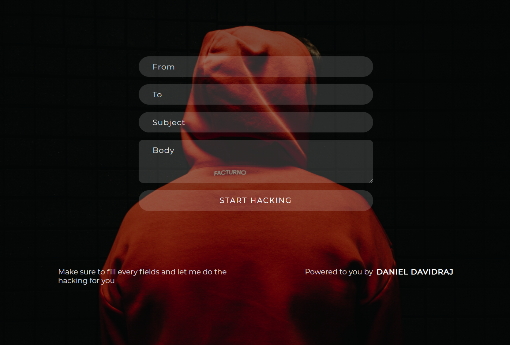

# Email-Hacker
Pranking friends by sending emails from their account can be fun  
Can it be practical ?  
Check it out :
[Email Hacker](https://danieldavidraj.rf.gd/?i=1)

## Step 1 :
* Hacking can be misused,but don't worry the password is not revealed from me to get full access
* Or try the [Demo](http://danieldavidraj.rf.gd/Demo.php) to check if this really works

## Step 2 :
* Make sure to fill all the fields and I'll do the hacking for you
* You can send mails from any account to any account

# Happy Hacking

